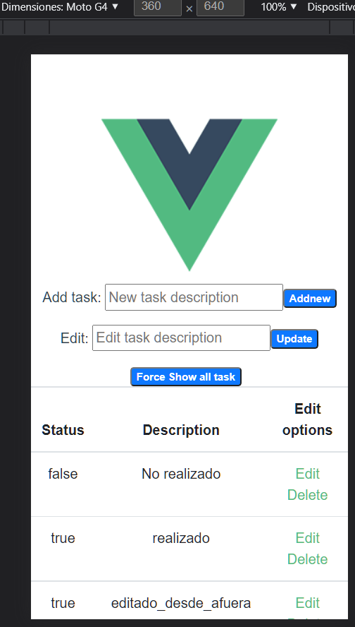
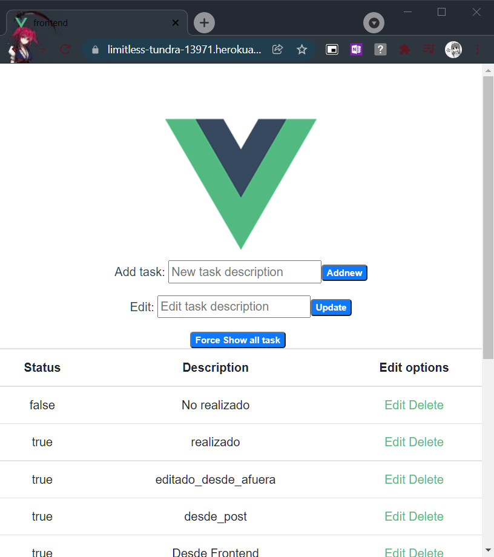

# Instrucciones de ejecución
## Usando el Script Bash

//NO SUPERADO

## Manualmente
### Backend
 1. navegar a la carpeta del backend
 2. ejecutar " `npm install `" para reinstalar las dependencias
 3. ejecutar " `node .\index.js `"

### Frontend
1. navegar a la carpeta del frontend
2. ejecutar "`npm install `"
3. ejecutar " `npm run serve `" (abre el server en modo desarrollo y proporciona la URL de acceso)

# Backend
Realizado con Express y Sequelizer.
Sequelizer es el "ORM", el server actual solo funciona como API. las distintas consultas se pueden hacer mediante distintos protocolos HTTP a la dirección " ` ~/api/app/ `"
La base de datos esta en la nube y se incluyen las credenciales en este pack
Deployado [En esta URL de herokuapp](https://blooming-dawn-71825.herokuapp.com/).

## Consultas al API
###  Crear tarea
HTTP POST con; `{ "realizado: (0 , 1)","description" : (String)
}`
##### Retorno
Si fue exitoso retorna (200) un JSON con el campo nuevo
Si no lo fue, retorna (500) 

###  Obtener todas las tareas
HTTP GET 

#### retorno
200 con arreglo de Json de todos los campos.
500 si sucedió algún error

###  Obtener tarea por ID
HTTP GET a " `~/api/app/:id` " donde ":id" es el identificador de la tarea en la base de datos 
##### Retorno
200 con el Json del elemento

###  Actualizar tarea por ID
HTTP PUT a " ` ~/api/app/:id`" donde ":id" es el identificador de la tarea en la base de datos 
##### Retorno
200 con mensaje " `id=${id} was updated successfully.`"
500 si no se puedo actualizar

###  Borrar tarea por ID
HTTP DELETE a " `~/api/app/:id `" donde " `:id `"  es el identificador de la tarea en la base de datos 
##### Retorno
200 con mensaje " `id=${id} was updated successfully.`"
500 si no se puedo actualizar

#  Frontend
Realizado con VUE incluye Bootstrap para que sea "responsive"
Deployado [En esta URL de herokuapp](https://limitless-tundra-13971.herokuapp.com/)

## Desafios superados
* Agregar una tarea
* Eliminar una tarea
 
## Desafios No superados
* Editar una tarea
* Adicionales (Carpeta organizativa / login)
* Mostrar por pantalla todas las tareas al ingresar
